# Spatial Relations

Spatial relations are described by spatial predicates - keywords that indicate the type of relationship each spatial object has with another. Spatial relations are expressed as semantic triples:

> _subject_ - __predicate__ - _object_

The spatial objects in the visual samples are represented as boxes (bounding box of the object) and their label indicates their front side. 

## Topology

### Proximity

| Predicate | Relation  | Specification | Visual Sample |
| --- | ---- | ---- | -------- | 
| `near` | subj is __near__ by obj | <ul><li>center of subject is not inside / not in `.i` sector</li><li>center distance < nearby condition of adjustment</li><li>delta = center distance</li></ul> |  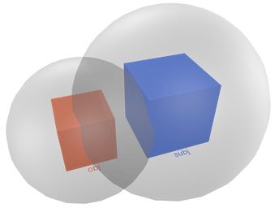 |
| `far` | subj is __far__ from obj | <ul><li>center distance > nearby condition of adjustment</li><li>delta = center distance</li></ul> |  |

### Directionality

| Predicate | Relation  | Specification | Visual Sample |
| --- | ---- | ---- | -------- | 
| `left` | subj is __left__ of obj | <ul><li>center of subject is in `.l` sector</li><li>may overlap</li><li>no distance condition</li><li>valid in OCS</li><li>delta = center distance</li></ul>  | 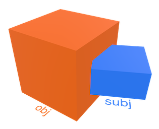 |
| `right` | subj is __right__ of obj | <ul><li>center of subject is in `.r` sector</li><li>may overlap</li><li>no distance condition</li><li>valid in OCS</li><li>delta = center distance</li></ul> | 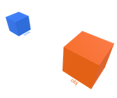 |
| `ahead` | subj is __ahead__ of obj | <ul><li>center of subject is in `.a` sector</li><li>may overlap</li><li>no distance condition</li><li>valid in OCS</li><li>delta = center distance</li></ul> |  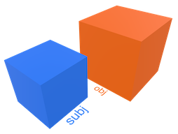 |
| `behind` | subj is __behind__ obj | <ul><li>center of subject is in `.b` sector</li><li>may overlap</li><li>no distance condition</li><li>valid in OCS</li><li>delta = center distance</li></ul> | 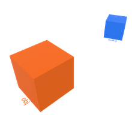 |
| `above` `over` | subj is __above__ obj subj is __over__ obj |<ul><li>center of subject is in `.o` sector</li><li>may overlap</li><li>no distance condition</li><li>valid in WCS, OCS, ECS</li><li>delta = center distance</li></ul> |  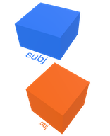 |
| `below` `under` | subj is __below__ obj subj is __under__ obj | <ul><li>center of subject is in `.u` sector</li><li>may overlap</li><li>no distance condition</li><li>valid in WCS, OCS, ECS</li><li>delta = center distance</li></ul> | 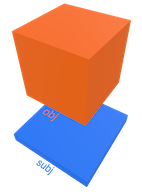 |

### Adjacency

| Predicate | Relation  | Specification | Visual Sample |
| --- | ---- | ---- | -------- | 
| `leftside` | subj is at __leftside__ of obj | <ul><li>center of subject is in `.l` sector</li><li>is near</li><li>is not overlapping</li><li>valid in OCS</li><li>delta = min distance</li></ul> |  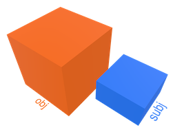 |
| `rightside` | subj is at __rightside__ of obj | <ul><li>center of subject is in `.r` sector</li><li>is near</li><li>is not overlapping</li><li>valid in OCS</li><li>delta = min distance</li></ul> | 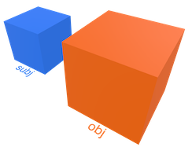 |
| `frontside` | subj is at __frontside__ of obj | <ul><li>center of subject is in `.a` sector</li><li>is near</li><li>is not overlapping</li><li>valid in OCS</li><li>delta = min distance</li></ul>  | 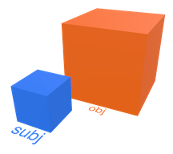 |
| `backside` | subj is at __backside__ of obj | <ul><li>center of subject is in `.b` sector</li><li>is near</li><li>is not overlapping</li><li>valid in OCS</li><li>delta = min distance</li></ul> | 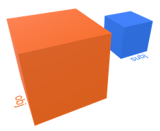 |
| `upperside` | subj is at __upperside__ of obj | <ul><li>center of subject is in `.o` sector</li><li>is near</li><li>is not overlapping</li><li>valid in WCS, OCS, ECS</li><li>delta = min distance</li></ul>  | 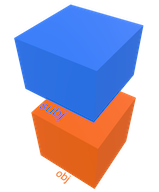 |
| `lowerside` | subj is at __lowerside__ of obj | <ul><li>center of subject is in `.u` sector</li><li>is near</li><li>is not overlapping</li><li>valid in WCS, OCS, ECS</li><li>delta = min distance</li></ul> |  |
| `ontop` | subj is __ontop__ of obj | <ul><li>center of subject is in `.o` sector</li><li>is near</li><li>is not overlapping</li><li>min distance < max gap</li><li>valid in WCS, OCS, ECS</li><li>delta = min distance</li></ul>  | 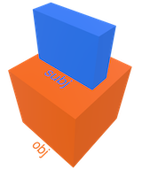 |
| `beneath` | subj is __beneath__ obj | <ul><li>center of subject is in `.u` sector</li><li>is near</li><li>is not overlapping</li><li>min distance < max gap</li><li>valid in WCS, OCS, ECS</li><li>delta = min distance</li></ul> |  |

## Orientations

| Predicate | Relation  | Specification | Visual Sample |
| --- | ---- | ---- | -------- | 
| `aligned` | subj is __aligned__ with obj | <ul><li>same angle orientation</li><li>angle diff < max angle</li><li>valid in WCS, OCS, ECS</li><li>delta = central distance</li></ul>  | 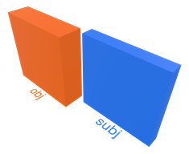 |
| `frontaligned` | subj is __front aligned__ with obj | <ul><li>same angle orientation</li><li>angle diff < max angle</li><li>same front</li><li>min distance < max gap</li><li>valid in WCS, OCS, ECS</li><li>delta = min distance</li></ul> |  |
| `orthogonal` | subj is __orthogonal__ to obj | <ul><li>is perpendicular</li><li>angle diff < max angle ±90°</li><li>valid in WCS, OCS, ECS</li></ul> |  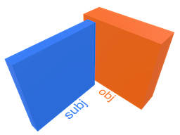 |
| `opposite` | subj is __opposite__ to obj | <ul><li>are facing eachother</li><li>angle diff < max angle ±180°</li><li>valid in WCS, OCS, ECS</li><li>delta = center distance</li></ul> | 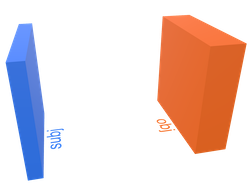 |

## Arrangements

.disjoint, .inside, .containing, .overlapping, .crossing, .touching, .meeting, .beside, .fitting, .exceeding

## Connectivity
 
| Predicate | Relation  | Specification | Visual Sample |
| --- | ---- | ---- | -------- | 
| `on` | subj is __on__ obj | <ul><li>is near</li><li>is on top</li><li>min distance < max gap</li><li>valid in WCS, OCS, ECS</li><li>delta = min distance</li></ul>  | 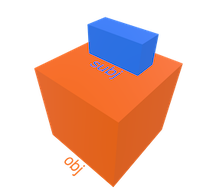 |
| `at` | subj is __at__ obj | <ul><li>is beside</li><li>is meeting</li><li>min distance < max gap</li><li>valid in WCS, OCS, ECS</li><li>delta = min distance</li></ul> |  |
| `by` | subj is __by__ obj | <ul><li>is touching</li><li>min distance < max gap</li><li>valid in WCS, OCS, ECS</li><li>delta = min distance</li></ul> |  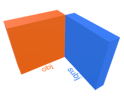 |
| `in` | subj is __in__ obj | <ul><li>is inside</li><li>valid in WCS, OCS, ECS</li></ul> |  |

## Sectoriality
