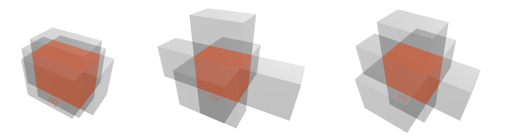

# Spatial Reasoning

> _A flexible 3D Spatial Reasoning library_

## Features

* Small: easy to integrate with existing Computer Vision, 3D, VR, XR and AR toolkits
* Powerful: inferencing on 3D objects and their spatial relations
* Extensive: 100+ spatial predicates and relations 
* Appropriate: handles fuzzyness and confidence of spatial situations
* Comprehensible: simple yet powerful inference pipeline in textual specification
* Flexible: use for 3D queries, spatial rule engines, semantic processing in 3D, voice interaction in space, with spatial-related LLM or with Large World Models (LWM), ...

## Usage

The main process of the Spatial Reasoning library consists of the following sequence: 
- match 3D items of your application to spatial objects in fact base  
- derive spatial attributes (done automatically)
- deduce spatial relations (done automatically, configurable)
- run pipeline of inference operations (defined as text)
- access result
- repeat with updated fact base 

```swift
// map detected or created 3D entities to SpatialObject instances
let obj1 = SpatialObject(id: "1", position: .init(x: -1.5, y: 0, z: 0), width: 0.1, height: 1.0, depth: 0.1)
let obj2 = SpatialObject(id: "2", position: .init(x: 0, y: 0, z: 0), width: 0.8, height: 1.0, depth: 0.6)
let obj3 = SpatialObject(id: "3", position: .init(x: 0, y: 0, z: 1.6), width: 0.8, height: 0.8, depth: 0.8)
obj3.angle = .pi/2.0

// initialize reasoner and run pipeline
let sr = SpatialReasoner()
sr.load([obj1, obj2, obj3])
let pipeline = "filter(volume > 0.4) | pick(left AND above) | log()"
if sr.run(pipeline) {
    // access list of SpatialObject resulted from processed pipeline
    let result = sr.result()  
    ...
}
```

## Motivation

This library deals with representing and reasoning about the topology of spatial 3D objects using derived attributes and deduced relations, such as the adjacency between or the topological arrangement of spatial objects. Spatial reasoning is the ability to conceptualize the three-dimensional relationships of objects in space and to evaluate spatial conditions in a specific indoor or outdoor context. Spatial reasoning can be executed as a succession of inference operations in a pipeline which takes spatial attributes of and spatial relations between objects into consideration. 

Spatial fuzziness affects information retrieval in space. Object detection in state-of-the-art computer vision, machine learning, and Augmented Reality toolkits results in detected objects that vary their locations and do change and improve over time their orientations and boundaries in space. The object description is usually fuzzy and imprecise, yet some non-trivial conclusion can anyhow be deduced. The geometric confidence typically improves over time. Additionally by taking spatial domain knowledge into account, semantic interpretation and therefore overall confidence can be improved. It is the goal of the Spatial Reasoning library to improve object detection with domain knowledge using spatial semantic and three-dimensional conditions.

## Syntax of Spatial Inference Pipeline

The spatial inference pipeline is defined as text specification. The pipeline is a linear sequence of inference operations which cover:
- __filter__: filter objects by matching spatial attributes
- __pick__: pick objects along their spatial relations
- __select__: select objects having spatial relations with others
- __log__: log the current status of the processing pipeline
- __deduce__: optional setup to specify relation categories to be deduced
- __sort__: sort objects by metric attributes of spatial objects
- (calc: calculate global variables in fact base)
- (map: calculate new object attributes)
- (produce: create new spatial objects relative to relations and add to fact base)

The inference operations within the pipeline are separated by "|". An inference operation follows the principle of _input - process - output_. Input and output data are list of spatial objects. The data flows from left to right along the pipeline so that the output of the former becomes the input of the next operation. The pipeline starts with all spatial objects of the fact base as input to the first operation.

Example:
```swift
let pipeline = """
    filter(volume > 0.4) 
    | pick(left AND above) 
    | log()
"""
```

The filter, pick, and select operations do change the list of output objects to be different from the input. All other operations do pass the list of input objects to the output, but may change sort order or add attribute values of the spatial objects.

| Op | Syntax | Examples |
| -------- | ------- | -------- | 
| __filter__  | `filter(`_attribute conditions_`)` | `filter(id == 'wall1'); filter(width > 0.5 AND height < 2.4); filter(type == 'furniture'); filter(thin AND volume > 0.4)` |
| __pick__  | `pick(`_relation conditions_`)` | `pick(near); pick(ahead AND smaller); pick(near AND (left OR right))` |
| __select__  | `select(`_relation ? attribute conditions_`)` | `select(ontop ? id == 'table1'); select(on ? type == 'floor'); select(ahead AND smaller ? footprint < 0.5)` |
| __log__  | `log(base 3D `_relations_`)` | `log(); log(base); log(3D); log(near right); log(3D near right)` |
| __deduce__  | `deduce(`_relation categories_`)` | `deduce(topology); deduce(connectivity); deduce(visibility)` |
| __sort__  | `sort(`_metric attribute_`)` | `sort(length); sort(volume); sort(width <); sort(width >)` |
| __sort__  | `sort(`_relation attribute_`)` | `sort(near.delta); sort(frontside.angle); sort(near.delta <);` |
| __map__  | `map(`_attribute assignment_`)` | `map(weight = volume * 140.0)` |
| __calc__  | `calc(`_variable assignment_`)` | `calc(cnt = objects.@count); calc(maxvol = objects.volume@max; median = objects.volume@median)` |
| __produce__  | `produce(`_relation conditions_` : `_type wxdxh_`) | `produce(container : room); produce(wall by wall on floor : corner 0.2x0.2x0.2)` |


## Logging Operation log()

Log files are used for debug purposes and are saved per default in the Downloads folder.

- `log()` or `log(selected relations)`
  - Log as markdown file
  - Overview list of spatial objects
  - Spatial relations graph (all or selection)
  - Contact graph
  - List of relations
- `log(3D)`
  - Scene of fact base as USDZ file
  - Spatial objects rendered in 3D for visualization
- `log(base)`
  - Fact base as JSON file
  - Array of spatial objects with their atrributes
  - Calculated variables with their values
  - Chain of results from processed pipeline

## Setup Operation deduce()

Spatial predicate categories of relations:
- topology
- connectivity (= contacts)
- directionality (= sectors)
- comparability
- visibility
- geography

## Spatial Adjustment

The spatial reasoner can be adjusted to fit the actual context, environment and dominant object size.
Set adjustment parameters before executing pipeline or calling relate() method.
SpatialReasoner has its own local adjustment that should be set upfront.

```swift
class SpatialAdjustment {
    // Max deviations
    var gap:Float = 0.05 /// gap ist max distance of deviation in all directions in meters
    var angle:Float = 0.05 * .pi /// angle is max delta of yaw orientation in radiants in both directions
    // Sector size
    var sectorSchema:SectorSchema = .wide
    var sectorFactor:Float = 1.0 /// sectorFactor is multiplying the result of claculation schema
    var sectorLimit:Float = 2.5 /// sectorLimit is maximal length
    var fixSectorLenght:Float = 0.25
    var wideSectorLenght:Float = 10.0
    // Vicinity
    var nearbyFactor:Float = 1.0 /// nearbyFactor is multiplying radius sum of object and subject (relative to size) as max distance
    var nearbyLimit:Float = 2.0 /// nearbyLimit is maximal absolute distance
    // Proportions
    var longRatio:Float = 4.0 /// one dimension is factor larger than both others
    var thinRatio:Float = 10.0 /// one dimension is 1/factor smaller than both others
}
```

Calculation schema to determine sector size for extruding area

```swift
public enum SectorSchema {
    case fixed // use specified fix lenght for extruding area
    case dimension // use same dimension as object multiplied with factor
    case perimeter // use area perimeter multiplied with factor
    case area // use area multiplied with factor
    case nearby // use nearby settings for extruding
    case wide // use fix wide
}
```

## BBox Sectors

Different BBox sectors size depending on calculation schema and adjustment settings.

Example of different spatial adjustments and calculation scheme:


left: `.fized`, middle: `.dimension`, right: `.nearby`

## Spatial Object


## Spatial Relations

- Spatial relation: subject - predicate - object
- Spatial predicates

See detailed description of all [spatial relatioms](DOCU/Relations.md).
